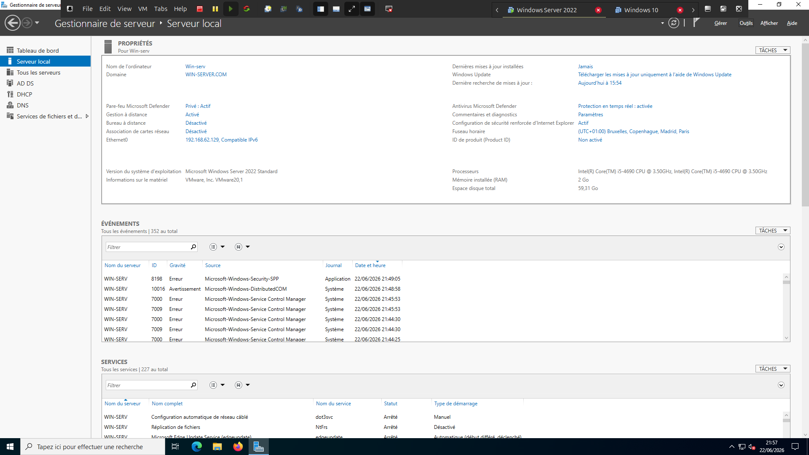
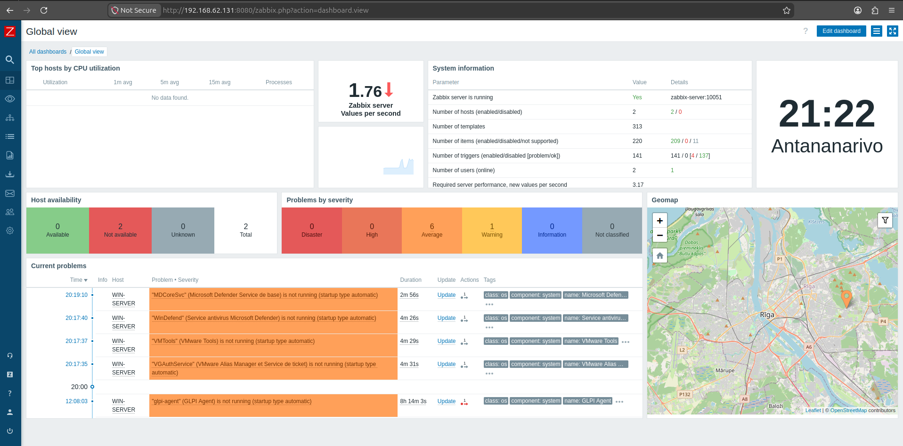
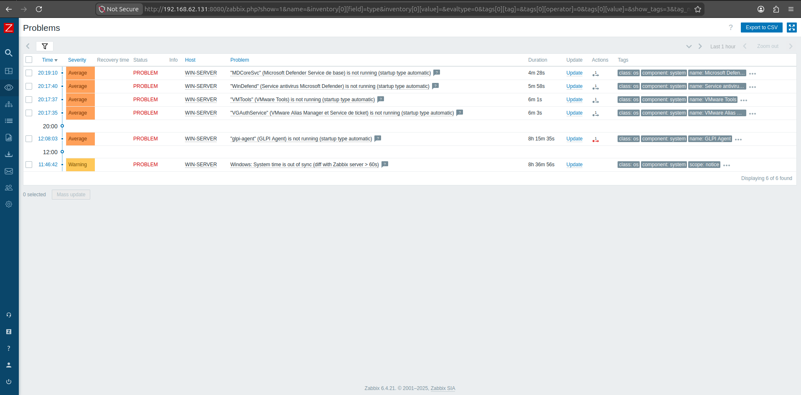
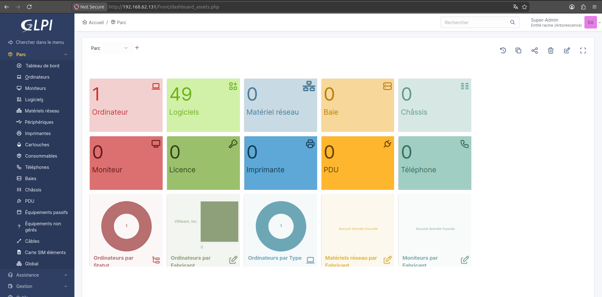
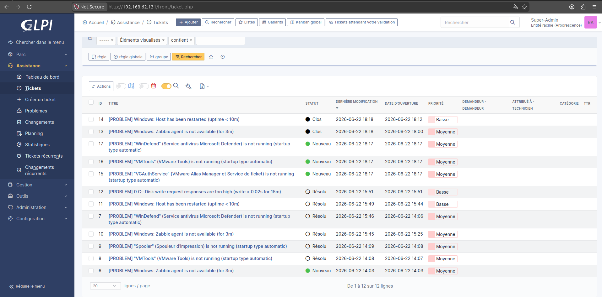
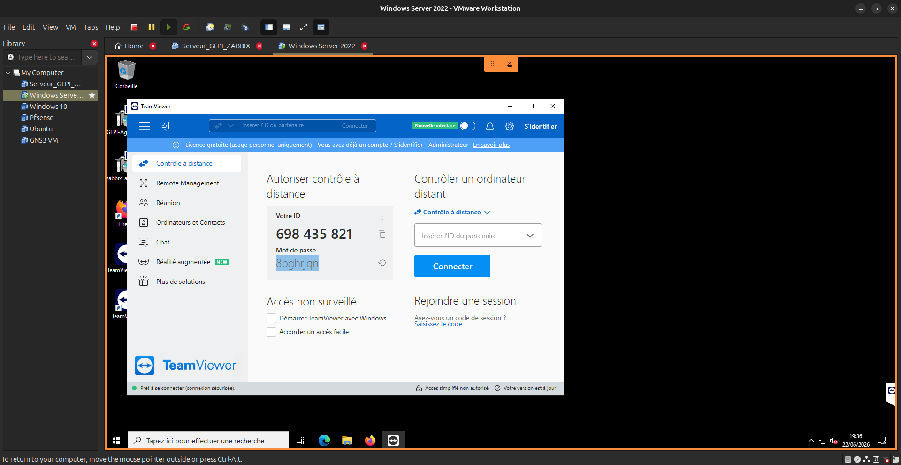

# Projet : Infrastructure Système, Supervision et Support IT

Ce projet présente le déploiement et l'administration d'une infrastructure d'entreprise virtualisée, intégrant la gestion des identités, la supervision proactive des services et un workflow de support ITIL. L'ensemble est architecturé sur des environnements Windows Server et Linux (Docker) pour une gestion centralisée et efficace des ressources.

## 🏗️ Architecture du Système
* **Contrôleur de Domaine :** Windows Server (Active Directory, DNS, DHCP, GPO).
* **Serveur Applicatif :** Ubuntu Server (Hébergement de services en conteneurs Docker).
* **Accès distant :** Maintenance corrective et télémaintenance via TeamViewer.

## 🛠️ Concepts & Technologies Implémentés

* **Administration Système (Active Directory) :** Mise en place d'un domaine complet avec gestion centralisée des utilisateurs et des groupes. Déploiement automatisé de politiques de personnalisation via **GPO** (ex: fonds d'écran uniformisés).
* **Supervision Proactive (Zabbix) :** Monitoring en temps réel des services critiques du serveur AD et de la disponibilité du réseau. Alerting configuré pour anticiper les pannes avant l'impact utilisateur.
* **Gestion de Parc et Ticketing (GLPI) :** Inventaire automatisé des équipements et cycle de vie des tickets de support selon la méthodologie **ITIL**. Traçabilité complète des interventions.
* **Virtualisation & Conteneurisation :** Isolation des services via **Docker**, permettant une gestion optimisée des ressources et une haute disponibilité des outils de monitoring.
* **Support & Maintenance :** Workflow de résolution d'incidents, de l'enregistrement du ticket à la télémaintenance sécurisée sur les serveurs critiques.

## 📈 Workflow ITIL (Cycle de vie d'un incident)

1.  **Détection :** Zabbix identifie une anomalie sur le serveur AD (ex: service DNS arrêté).
2.  **Enregistrement :** Création automatique ou manuelle d'un ticket dans GLPI.
3.  **Diagnostic :** Analyse de l'inventaire matériel/logiciel via la fiche GLPI.
4.  **Intervention :** Prise de main à distance (TeamViewer) depuis le poste hôte vers la VM cible.
5.  **Clôture :** Résolution et archivage du ticket avec documentation de la procédure appliquée.

## 🧪 Validation & Tests (Preuves de fonctionnement)

* **Gestion des Identités :** Serveur Windows 2022.
<p align="center">
  
</p>
<p align="center">
  
</p>
* **Supervision :** Dashboard Zabbix opérationnel affichant l'état de santé des services critiques du serveur Windows.
<p align="center">
  
</p>
<p align="center">
  
</p>
* **Inventaire :** Remontée automatique des informations systèmes dans l'interface GLPI et gestion de tickets.
<p align="center">
  
</p>
<p align="center">
  
</p>
* **Télémaintenance :** Session distante établie et stable entre l'hôte (Ubuntu) et le contrôleur de domaine (VM Windows).
<p align="center">
  
</p>
## ⚙️ Documentation des Services

Les procédures d'installation et les fichiers de configuration (Docker Compose, scripts AD) sont disponibles dans le dossier `/docs` et `/scripts`.

<details>
<summary>💻 Cliquez pour accéder à la documentation et aux configurations</summary>

```bash
# Exemple de stack Docker pour GLPI + Zabbix
docker-compose up -d

# Vérification du statut des conteneurs
docker ps
